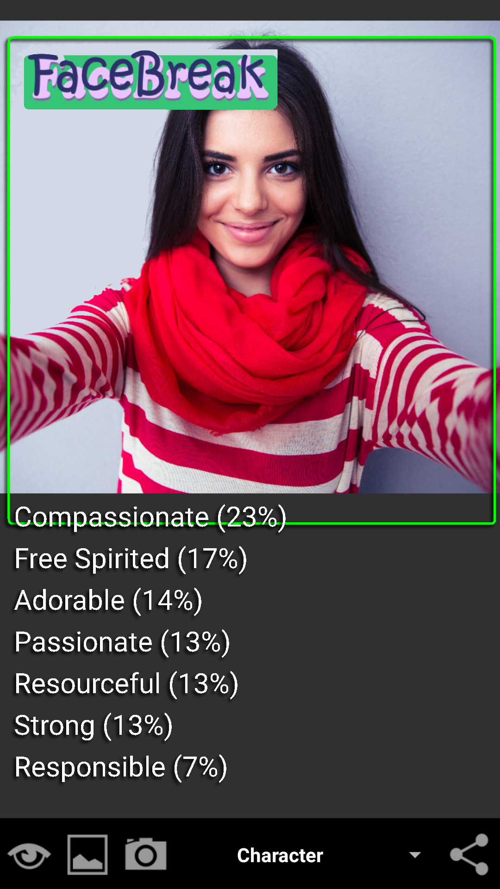

<div align="center">


# FaceBreak

**On-device facial analysis for Android, powered by 14 TensorFlow Lite models.**

[](https://play.google.com/store/apps/details?id=com.thomasjbarrerasconsulting.faces)
[](https://play.google.com/store/apps/details?id=com.thomasjbarrerasconsulting.faces)
[](https://www.tensorflow.org/lite)

[**Get it on Google Play →**](https://play.google.com/store/apps/details?id=com.thomasjbarrerasconsulting.faces)

</div>

---

<div align="center">

</div>

## What it does

FaceBreak analyzes a face photo and returns predictions across 14 traits — age, ancestry, emotions, eye color, face shape, gender, hair color and style, headwear, eyebrows, jaw, facial features, character, and character flaws. All inference runs **on-device**; photos never leave the phone.

## Screenshots

<div align="center">

| Ancestry | Character | Character Flaws |
| :---: | :---: | :---: |
|  |  |  |

</div>

## Demo videos

Walkthroughs and feature demos are on the [**Red Baron Software YouTube channel**](https://www.youtube.com/@RedBaronSoftwarebyThomasJBarre).

## Tech stack

- **Platform:** Android (Kotlin / Java)
- **ML runtime:** TensorFlow Lite — 14 `.tflite` models executed on-device
- **Services:** Firebase, Google Play Billing (premium IAP)
- **Privacy by design:** no image ever leaves the device; no server-side inference

## About the author

Built by **Thomas J. Barreras** — available for contract and consulting work through [Thomas J. Barreras Consulting](https://github.com/Thomas-J-Barreras-Consulting).

---

## For developers

<details>
<summary><strong>Build setup</strong></summary>

Several files required to build this project are stored in a separate private repository for security reasons. Authorized contributors can obtain the ML models, `local.properties`, and `google-services.json` from there. To request access, contact the repository owner.

### ML Models

The TensorFlow Lite model files (`.tflite`) are **not** included in this repo.

Once you have the model files, place them in:

```
app/src/main/ml/
```

The following models are required:

- `AgeModel5.tflite`
- `AncestryModel9.tflite`
- `CharacterFlawsModel3.tflite`
- `CharacterModel4.tflite`
- `EmotionsModel1600.tflite`
- `EyeColorModel3.tflite`
- `EyebrowsModel.tflite`
- `FaceShapeModel1000d.tflite`
- `FeaturesFaceModel5.tflite`
- `GenderModel2.tflite`
- `HairColorModel8.tflite`
- `HairStyleModel4.tflite`
- `HeadwearModel3.tflite`
- `JawModel5.tflite`

### Local Properties

The `local.properties` file is not included in the repo. Android Studio will auto-generate it when you first open the project, setting `sdk.dir` to your local Android SDK path.

This file also contains a `base64EncodedPublicKey` used for Google Play billing verification. If you need in-app purchase functionality, obtain this key from the private repository. Add it to your `local.properties`:

```
base64EncodedPublicKey=<key obtained from repository owner>
```

### Firebase Configuration

The `app/google-services.json` file is not included in the repo. This file is required for Firebase services. You have two options:

1. **Use the existing Firebase project** -- Obtain the `google-services.json` file from the private repository and place it in the `app/` directory.

2. **Create your own Firebase project** -- Set up a new project in the [Firebase console](https://console.firebase.google.com/), register an Android app with the package name `com.thomasjbarrerasconsulting.faces`, and download the generated `google-services.json` into the `app/` directory.

</details>
